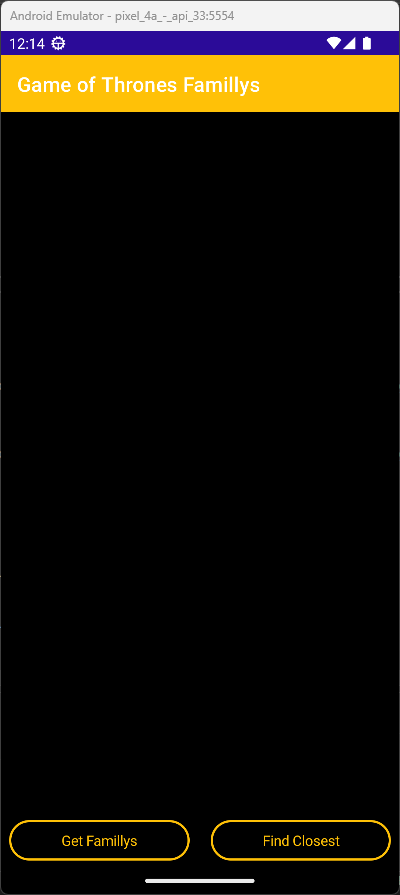

Paul FERREIRA - 5999222006

For the exercices I used an Game of Thrones database that regroups all the characters of the show in their familly.
For the detail page I used a list view because the famillys have different size.
The JSON file is stored locally but the pictures of the houses is store inside imgur.com.
I disabled the location functionally because I was impossible to put a location of fiction familly.

The screeens:

Thank you for watching,

Paul FERREIRA.
